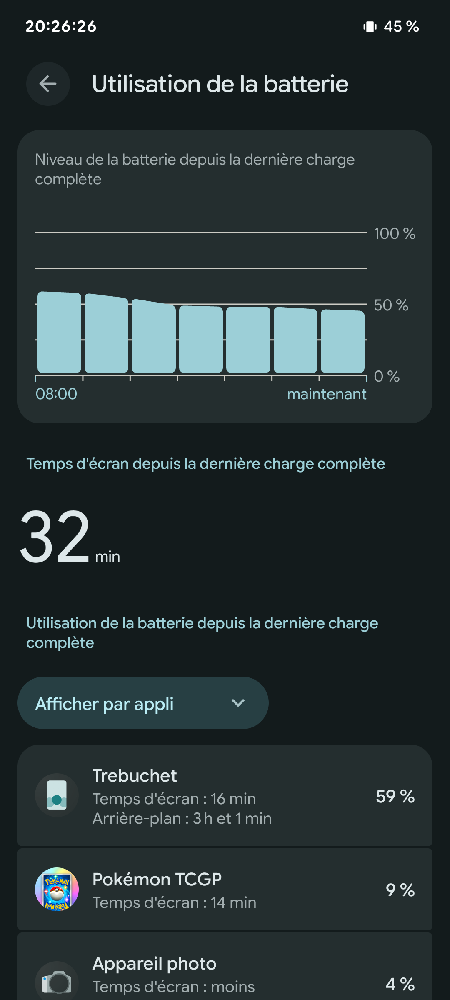
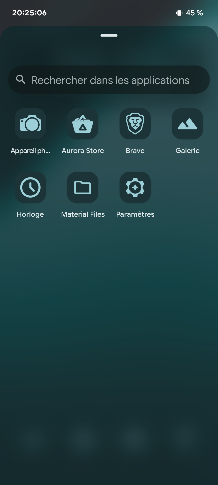
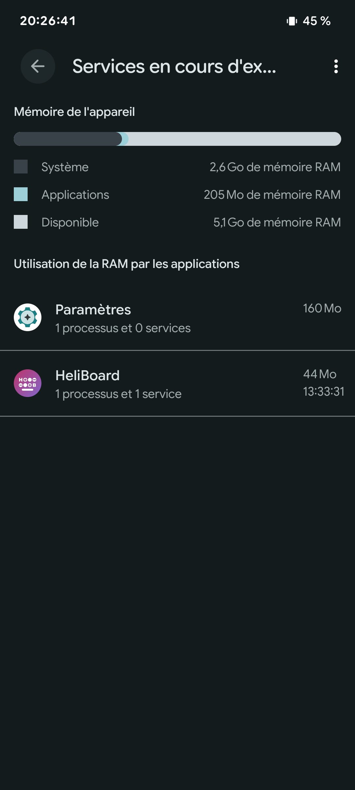
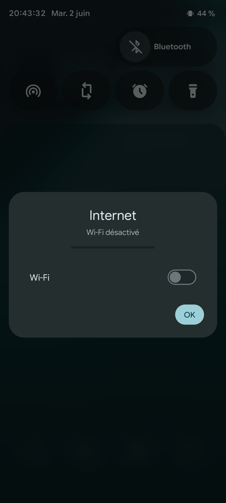

## Prerequisites and usage
To implement the Ruvomain Protocol, you must have the following tools installed and configured on your device:

- **Download [LineageOS 23.2](https://download.lineageos.org/devices/oriole/builds)**

- Download **MicroG Plus** (optional) with version that you want (aurora store, fdroid...) on this [page](https://bitgapps.io/extra.html)

- **Install** LineageOS and MicroG Plus, follow [instructions](https://wiki.lineageos.org/devices/oriole/install) here.

- **[Shizuku](https://shizuku.rikka.app/)**: Allows apps to use system APIs directly without root.

- **[Canta](https://github.com/samolego/Canta)**: Used to manage and uninstall system applications via Shizuku.

**Activate:** Enable Developer Options > Wireless Debugging. Pair Shizuku.

**Deploy:** Import the preferred `.json` file from the `/config` folder into Canta.

4.  **Finalize:** Reboot the device.

## Important Note
**This protocol is optimized for the Pixel 6 on LineageOS 23.2 Vanilla with or without MicroG Plus.**
For other devices, proceed with caution and verify your system compatibility. Usage on other hardware is at your own risk.

## Results Showcase
| Energy Efficiency | Refined Interface |
| :---: | :---: |
|  |  |
| **Battery Life:** 4h SOT achieved on a 4-year-old battery with 1,310+ charge cycles. Proving that the Ruvomain Protocol breathes new life into aging hardware. | **Minimalism:** Nobloat, just the essentials. |

| Resource Management | Connectivity |
| :---: | :---: |
|  |  |
|**RAM Usage:** Optimized background processes. | **Control:** Restricted network access. |

## Why Ruvomain?
- **Performance:** Reclaim system resources by removing unnecessary background processes.
- **Battery:** Significant reduction in standby drain.
- **Privacy:** Eliminate pre-installed tracking and telemetry.
- **Control:** Own your device, not just rent it from the manufacturer.

## About the Test Device
- **Device:** GooglePixel 6
- **Battery Status:** 4 years old / 1,310 cycles
- **Result:** Even with a degraded battery, the Ruvomain Protocol ensures 4h SOT and optimized standby drain.

---
*My other project on github for [Samsung Galaxy S24+ stock OneUI 8.5](https://github.com/Ruvyrom/Ruvomain-Protocole)*

*Stay clean, stay fast, stay Ruvomain!* 🚀
